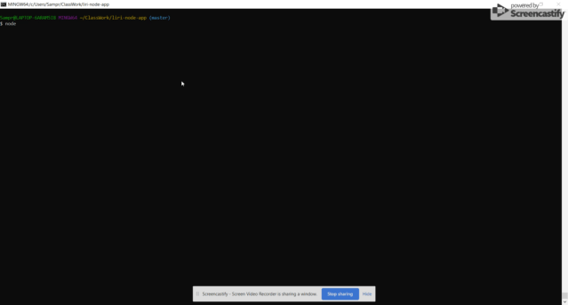
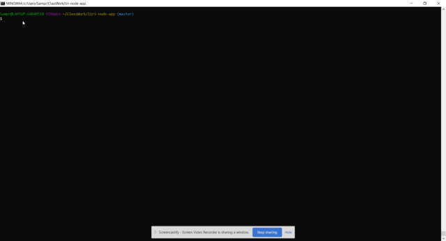

LIRI-Bot
LIRI is like iPhone's SIRI. However, while SIRI is a Speech Interpretation and Recognition Interface, LIRI is a Language Interpretation and Recognition Interface. LIRI will be a command line node app that takes in parameters and gives you back data.

What Each Command Does

node liri.js spotify '<song name here>'

This will show the following information about the song on the terminal/bash window

Artist(s)

The song's name

A preview link of the song from Spotify

The album that the song is from

If no song is provided then the program will default to "Real Slim Shady" by Eminem.

node liri.js movie '<movie name here>'

This will output the following information on the terminal/bash window:

  * Title of the movie.
  * Year the movie came out.
  * IMDB Rating of the movie.
  * Rotten Tomatoes Rating of the movie.
  * Country where the movie was produced.
  * Language of the movie.
  * Plot of the movie.
  * Actors in the movie.

If the user doesn't type a movie in, the program will output data for the movie 'Mr. Nobody.'

node liri.js do-what-it-says

Using the fs Node package, LIRI will take the text inside of random.txt and then use it to call one of LIRI's commands.

It runs spotify-this-song for "I Want it That Way," since that's the value in random.txt.

Copyright
Sam Proschansky, Georgia Tech Coding Boot Camp (C) 201. All Rights Reserved.

### Demo

